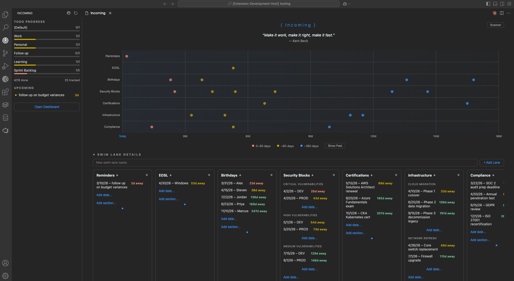
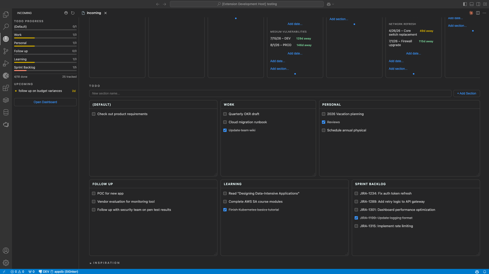

# Inc0ming

A VS Code extension that turns a simple `inc0ming.md` markdown file into an interactive radar + todo dashboard.





## Features

- **Radar Scanner** — Canvas-based radar grid with animated sweep line, swimlane rows, and color-coded blips by urgency (0-30 days, ~90 days, ~180 days)
- **Swimlane Details** — Expandable cards for each swimlane with sub-groups, drag-to-reorder, and inline add/edit/delete
- **TODO Grid** — Resizable, draggable widget cards per section with checkbox items, drag-and-drop between sections, and inline editing
- **Inspiration** — Random quote display with a collapsible management section for adding, editing, and deleting quotes
- **Markdown Powered** — All data lives in `inc0ming.md` at the workspace root. Edit it by hand or through the dashboard — changes sync both ways.

## Getting Started

1. Install the extension
2. Create an `inc0ming.md` file in your workspace root (or let the extension create one)
3. Click the Inc0ming icon in the activity bar, or run **Inc0ming: Open Dashboard** from the command palette

## inc0ming.md Format

```markdown
# Radar

## Work
- 3/15/26 - Deploy to production
### Backend
- 4/1/26 - API migration

## Personal
<!-- color: #ff6b6b -->
- 3/20/26 - Dentist appointment

# Quotes

> The best way to predict the future is to create it — Peter Drucker

# TODO

## This Week
* [ ] Review pull requests
    - Check test coverage
    - Verify API changes
* [x] Update dependencies

## Backlog
* [ ] Refactor auth module {radar:Work}
```

### Format Reference

| Element | Syntax |
|---------|--------|
| Swimlane | `## Name` under `# Radar` |
| Swimlane color | `<!-- color: #hex -->` after swimlane heading |
| Sub-group | `### Name` under a swimlane |
| Radar item | `- M/D/YY - Label` (no leading zeros, 2-digit year) |
| Todo section | `## Name` under `# TODO` |
| Todo item | `* [ ] Text` or `* [x] Text` |
| Todo detail | `    - Detail` (4 spaces indent) |
| Radar link | `* [ ] Text {radar:Swimlane}` |
| Quote | `> Text — Attribution` (em dash or `--`) |

## Configuration

| Setting | Default | Description |
|---------|---------|-------------|
| `inc0ming.notifications.enabled` | `true` | Enable date-based notifications for radar items |
| `inc0ming.notifications.warningDays` | `7` | Days before a radar date to show a warning |
| `inc0ming.notifications.urgentDays` | `1` | Days before a radar date to show an urgent notification |

## Commands

All commands are available via the command palette (`Ctrl+Shift+P` / `Cmd+Shift+P`) under the **Inc0ming** category:

- **Open Dashboard** — Open the main radar + todo dashboard
- **Refresh** — Reload data from `inc0ming.md`
- **Add Swim Lane** / **Add Radar Item** / **Add Todo** / **Add Todo Section**
- **Add Quote** / **Edit Quote** / **Delete Quote**
- **Edit** / **Delete** / **Toggle Complete**

## Building from Source

```bash
npm install
npm run compile
npx @vscode/vsce package --allow-missing-repository
```

The resulting `.vsix` can be installed via **Extensions > ... > Install from VSIX**.

## Development

1. Open this folder in VS Code
2. Press `F5` to launch the Extension Development Host
3. Run `npm run watch` for live TypeScript compilation

## License

ISC
